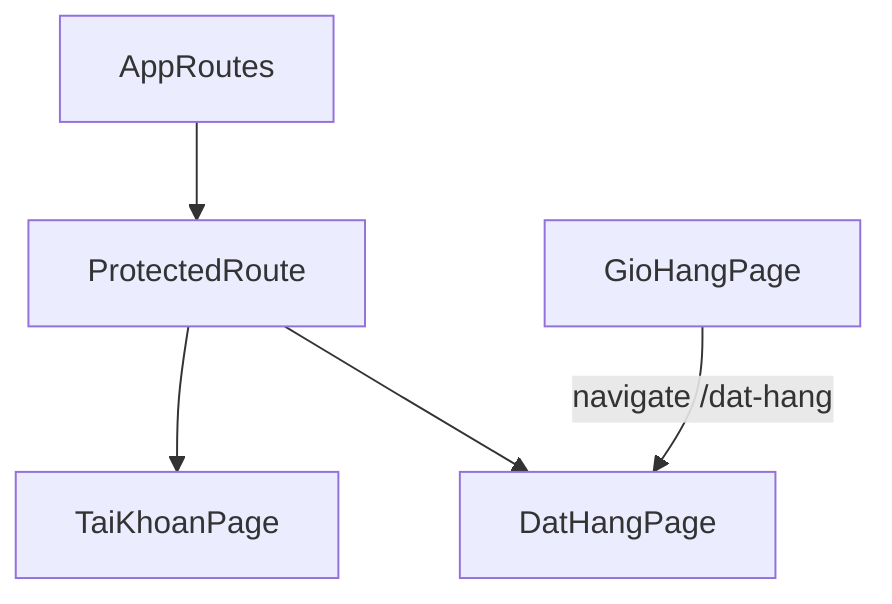
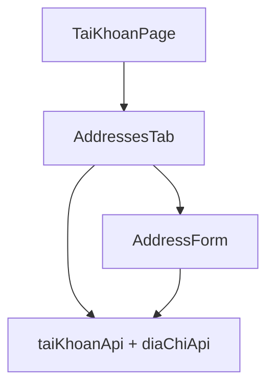
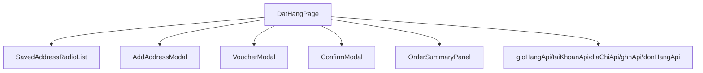
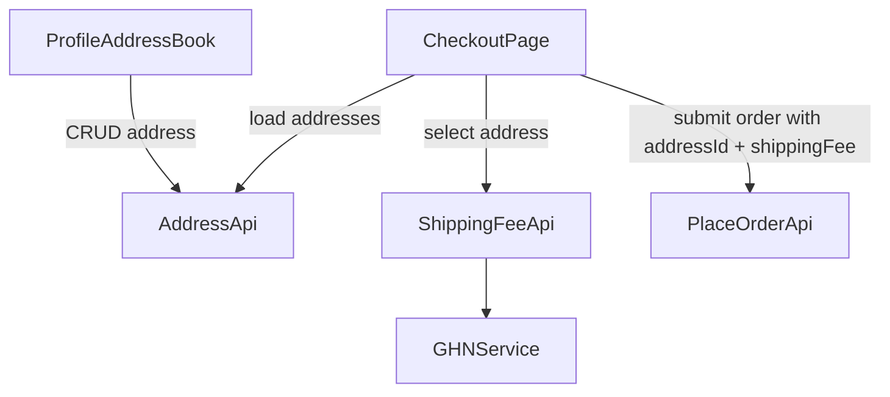

# Address Checkout Blueprint (WatchAura Migration)

Tai lieu nay boc tach toan bo logic hien tai cua:
- Quan ly So dia chi (Address Book)
- Chon dia chi o Checkout va tinh phi ship

Muc tieu: dung lam tai lieu ban giao ky thuat de migrate sang project WatchAura voi UX/UI cao cap hon, dong bo hon, an toan hon.

---

## 1) Executive Context for WatchAura

Codebase hien tai da co day du xuong song nghiep vu cho Address Book + Checkout Address:
- Luu dia chi user (CRUD + dia chi mac dinh)
- Chon dia chi da luu o checkout
- Tinh phi ship theo GHN dua tren district/ward
- Day shipping fee vao don hang

Tuy nhien, implementation hien tai con mot so han che (hardcode, coupling, ownership validation...), nen WatchAura can giu nghiep vu dung, nhung nang cap architecture + DX + UX de mo rong va van hanh ben vung.

---

## 2) Data Models & Database Schema

## 2.1 Address Entity (Source of truth)

File: `d:\E_The\hoanchinh\Certain-SHop-SD-60-master\src\main\java\com\certainshop\entity\DiaChiNguoiDung.java`

- Table: `DiaChiNguoiDung`
- Quan he:
  - `NguoiDungId` (ManyToOne -> `NguoiDung`)
- Field mapping:
  - `id: Long` -> `Id`
  - `nguoiDung: NguoiDung` -> `NguoiDungId`
  - `hoTen: String` -> `TenNguoiNhan`
  - `soDienThoai: String` -> `SoDienThoai`
  - `diaChiDong1: String` -> `DiaChiCuThe`
  - `phuongXa: String` -> `PhuongXa`
  - `quanHuyen: String` -> `QuanHuyen`
  - `tinhThanh: String` -> `TinhThanh`
  - `maTinhGHN: Integer` -> `MaTinhGHN`
  - `maHuyenGHN: Integer` -> `MaHuyenGHN`
  - `maXaGHN: String` -> `MaXaGHN`
  - `laMacDinh: Boolean` -> `LaMacDinh`
  - `thoiGianTao: LocalDateTime` -> `ThoiGianTao`
  - `thoiGianCapNhat: LocalDateTime` -> `ThoiGianCapNhat`

Ghi chu:
- Entity co helper `getDiaChiDayDu()` de build chuoi dia chi hien thi.
- `@PrePersist`/`@PreUpdate` set timestamp.

## 2.2 Address DTO

File: `d:\E_The\hoanchinh\Certain-SHop-SD-60-master\src\main\java\com\certainshop\dto\DiaChiChiTietDto.java`

Payload/response cho address APIs gom:
- id, hoTen, soDienThoai, diaChiDong1
- phuongXa, quanHuyen, tinhThanh
- maTinhGHN, maHuyenGHN, maXaGHN
- laMacDinh, thoiGianTao

## 2.3 Checkout DTO (address-related fields)

File: `d:\E_The\hoanchinh\Certain-SHop-SD-60-master\src\main\java\com\certainshop\dto\DatHangDto.java`

Truong lien quan dia chi/shipping:
- `diaChiId` (chon dia chi da luu)
- Hoac dia chi nhap tay:
  - `tenNguoiNhan`
  - `soDienThoai`
  - `diaChiCuThe`
- GHN IDs:
  - `maTinhGHN`, `maHuyenGHN`, `maXaGHN`
- Ten hien thi:
  - `tenTinh`, `tenHuyen`, `tenXa`
- `luuDiaChi` (neu muon luu dia chi moi)
- `phiVanChuyen`

## 2.4 Order snapshot fields (shipping)

File: `d:\E_The\hoanchinh\Certain-SHop-SD-60-master\src\main\java\com\certainshop\service\DonHangService.java`

Khi tao don (`datHangOnline`), service snapshot vao `DonHang`:
- `phiVanChuyen`
- `maTinhGHN`, `maHuyenGHN`, `maXaGHN`
- `diaChiGiaoHang` (chuoi day du)
- `tenNguoiNhan`, `sdtNguoiNhan`

Y nghia: Order khong phu thuoc lai vao record address sau nay.

## 2.5 Luu y schema backup

Trong backup SQL (`Certain_Shop_FULL_BACKUP.sql`) co dau hieu lech ten cot so voi entity runtime (vi du `LaHienTai` vs `LaMacDinh`). Khi migrate WatchAura, uu tien model runtime dang duoc app su dung thuc te.

---

## 3) State Management & Data Flow

## 3.1 Profile Address Book flow

Frontend file chinh:
- `d:\E_The\hoanchinh\Certain-Shop-fe-master\src\pages\TaiKhoanPage.tsx`
- API client: `d:\E_The\hoanchinh\Certain-Shop-fe-master\src\services\api.ts`

State chinh trong tab dia chi:
- `danhSach: DiaChi[]`
- `loading`
- `showForm`
- `editing: DiaChi | null`

Flow:
1. Mount tab dia chi -> `load()` -> `taiKhoanApi.danhSachDiaChi()`
2. Them/sua dia chi mo form (`AddressForm`)
3. Luu thanh cong -> goi `onSave()` -> reload `danhSach`
4. Xoa dia chi -> `taiKhoanApi.xoaDiaChi(id)` -> reload
5. Dat mac dinh -> `taiKhoanApi.datLamMacDinh(id)` -> reload

Pattern dong bo:
- Tab profile va tab checkout khong dung chung global address store.
- Dong bo du lieu thong qua API reload sau moi thao tac.

## 3.2 Checkout flow (address + shipping)

Frontend file chinh:
- `d:\E_The\hoanchinh\Certain-Shop-fe-master\src\pages\DatHangPage.tsx`

State chinh:
- `diaChiList`, `selectedDiaChi`
- `tenNguoiNhan`, `sdtNguoiNhan`, `diaChiGiaoHang`
- `phiVanChuyen`, `loadingShip`
- `addressForm` (cho modal them dia chi ngay tai checkout)
- `shippingCalledRef` (chan goi lap)

Initial load:
1. Kiem tra dang nhap
2. `Promise.all`:
   - `gioHangApi.lay()`
   - `taiKhoanApi.danhSachDiaChi()`
   - `taiKhoanApi.layThongTin()`
3. Chon dia chi mac dinh (hoac dia chi dau tien)
4. Set thong tin nguoi nhan theo dia chi da chon

Khi user doi dia chi:
1. `handleDiaChiChange(dc)` cap nhat `selectedDiaChi` + text fields
2. Effect theo doi `selectedDiaChi.id`, `maHuyenGHN`, `maXaGHN`
3. Gọi `tinhPhiVanChuyen(maHuyen, maXa)` neu du dieu kien

Logic trigger ship recalc:
- Trigger khi dia chi duoc chon co district + ward GHN
- Trong luong tinh tam theo so item (`items * 300g`)
- API tinh fee: `ghnApi.tinhPhi`
- Loi => fallback 35000 tren FE

Khi dat hang:
1. Validate form
2. Build payload include:
   - recipient fields
   - `phiVanChuyen`
   - `diaChiId` + GHN IDs + ten tinh/huyen/xa (neu co selected address)
3. `donHangApi.datHang(payload)`

---

## 4) API Contracts (Address + Checkout Flow)

Response envelope chung:
- `thanhCong: boolean`
- `thongBao: string`
- `duLieu: T`
- `maLoi?: number`

## 4.1 Address Book APIs (FE dang goi)

Nguon FE: `d:\E_The\hoanchinh\Certain-Shop-fe-master\src\services\api.ts`

- `GET /tai-khoan/dia-chi`
  - Response: `ApiResponse<DiaChi[]>`
- `POST /tai-khoan/dia-chi`
  - Body: `DiaChi`
  - Response: `ApiResponse<DiaChi>`
- `PUT /tai-khoan/dia-chi/{id}`
  - Body: `Partial<DiaChi>`
  - Response: `ApiResponse<DiaChi>`
- `DELETE /tai-khoan/dia-chi/{id}`
  - Response: `ApiResponse<null>`
- `PUT /tai-khoan/dia-chi/{id}/mac-dinh`
  - Response: `ApiResponse<null>`

## 4.2 Location APIs (province/district/ward)

Nguon BE: `d:\E_The\hoanchinh\Certain-SHop-SD-60-master\src\main\java\com\certainshop\controller\api\DiaChiApiController.java`
Nguon FE client: `src/services/api.ts` (`diaChiApi`)

- `GET /api/dia-chi/tinh-thanh`
  - Response `duLieu`: `{ ProvinceID, ProvinceName }[]`
- `GET /api/dia-chi/quan-huyen?maTinh=<number>`
  - Response `duLieu`: `{ DistrictID, DistrictName }[]`
- `GET /api/dia-chi/phuong-xa?maHuyen=<number>`
  - Response `duLieu`: `{ WardCode, WardName }[]`

## 4.3 Shipping fee APIs

Dang duoc checkout su dung:
- `POST /api/ghn/fee?maHuyenNhan=&maXaNhan=&weight=`
  - Response `duLieu`: `{ fee: number }`
  - Controller: `d:\E_The\hoanchinh\Certain-SHop-SD-60-master\src\main\java\com\certainshop\controller\api\GHNApiController.java`

Co endpoint thay the trong DiaChiApiController:
- `POST /api/dia-chi/tinh-phi-ship?maHuyen=&maXa=&trongLuong=`
  - Response `duLieu`: `{ phiVanChuyen: number }`

## 4.4 Place order API

Nguon FE: `donHangApi.datHang`
Nguon BE: `d:\E_The\hoanchinh\Certain-SHop-SD-60-master\src\main\java\com\certainshop\controller\api\DonHangApiController.java`

- `POST /api/dat-hang`
  - Body: `DatHangDto`
  - Response: `ApiResponse<{...orderSummary, maDonHang, tongTienHang, phiVanChuyen, tongTienThanhToan, ...}>`
  - VNPAY flow co them `urlThanhToan`

---

## 5) Component Tree

## 5.1 Route-level tree

## 5.2 Profile Address Book tree

## 5.3 Checkout tree

---

## 6) Location Logic (Tinh/Huyen/Xa)

## 6.1 Current cascade behavior

Hien tai ca `TaiKhoanPage` va `DatHangPage` deu dung logic cascade:
1. Load province list on mount.
2. Khi user chon `maTinhGHN`:
   - Goi API lay district theo province.
   - Reset district + ward dang chon.
3. Khi user chon `maHuyenGHN`:
   - Goi API lay ward theo district.
   - Reset ward dang chon.
4. Khi submit:
   - Map ID -> ten (`ProvinceName`, `DistrictName`, `WardName`).
   - Gui ca ID GHN + ten text.

## 6.2 Trigger points va edge cases

- Edit address:
  - Khi vao form sua co kha nang bi reset district/ward do effect reset khi province thay doi.
- Checkout:
  - Trigger shipping tinh theo `selectedDiaChi.id` + district/ward fields.
  - Co guard `shippingCalledRef` de tranh goi lap.
  - Neu logic thay doi chi tiet ma id khong doi, co the bo sot recalc.

## 6.3 De xuat autofill UX cao cap hon cho WatchAura

- Dung cached dictionaries cho province/district/ward (stale-while-revalidate).
- Tien hanh prefetch district list ngay khi user hover/focus province combobox.
- Searchable async combobox co keyboard-first UX.
- Debounce network + abort request cu khi user doi nhanh.
- Persist temp draft address trong local state/store de khong mat du lieu khi dong modal.
- Tinh ship optimistic + skeleton thay vi blocking spinner.

---

## 7) Refactoring Notes (Critical)

## 7.1 Weak points/hardcode/risk hien tai

- Hardcoded fallback shipping fee 35000 xuat hien o FE va BE.
- Checkout service co nguy co ownership gap:
  - `diaChiId` duoc load theo id, can enforce dia chi phai thuoc user dang dat hang.
- Validation chua dong nhat:
  - DTO co annotation nhung controller co the chua bat `@Valid` day du.
- FE coupling:
  - `DatHangPage` qua lon, chua tach hook/component logic shipping-address.
- API contract chua thong nhat:
  - Co 2 endpoint tinh phi ship (`/api/ghn/fee` va `/api/dia-chi/tinh-phi-ship`) format khac nhau (`fee` vs `phiVanChuyen`).
- Weight tinh shipping dang heuristic rat don gian (`so item * 300g`), khong dua tren data product variant.
- Tai khoan/address sync phu thuoc reload toan bo danh sach sau moi action (co the lam UX delay).

## 7.2 Refactor target cho WatchAura

- Tach module `shipping` doc lap:
  - `ShippingProvider` abstraction
  - `GhnProvider` implementation
- Chuan hoa API contract shipping fee:
  - 1 endpoint duy nhat, 1 response schema
  - co `fallbackApplied`, `providerErrorCode`
- Chuan hoa ownership security:
  - Every read/update/delete address va order placement phai verify `address.userId == authUser.id`.
- Tinh shipping fee tren BE la source of truth (FE chi preview).
- Tinh weight theo tong khoi luong bien the thay vi heuristic.
- Tach FE state:
  - `useAddressBook`
  - `useCheckoutAddress`
  - `useShippingFee`
- Dong bo du lieu bang query cache invalidation (thay vi manual reload nhieu noi).

---

## 8) Migration Checklist for WatchAura

## Backend
- [ ] Tao Address schema dual-field (display names + provider IDs).
- [ ] Tao CRUD address + default address endpoint co ownership checks.
- [ ] Tao location APIs province/district/ward.
- [ ] Tao shipping fee endpoint contract chuan.
- [ ] Tinh va verify shipping fee o order placement.
- [ ] Snapshot shipping fields vao order.
- [ ] Bo hardcode token/secret/fallback vao config.
- [ ] Them unit/integration tests cho address ownership + shipping fallback.

## Frontend
- [ ] Tach component/hook cho Address Book va Checkout Address.
- [ ] Implement searchable cascade dropdown mượt (keyboard + async).
- [ ] Auto recalc shipping khi thay doi dia chi/ward.
- [ ] Show loading states/skeleton/error states tinh te.
- [ ] Dong bo cache address giua Profile va Checkout.
- [ ] Confirm modal hien thi ro shipping breakdown.

## QA/Release
- [ ] Test CRUD address + default behavior.
- [ ] Test checkout voi dia chi moi, dia chi da luu, doi dia chi lien tuc.
- [ ] Test provider fail -> fallback fee.
- [ ] Test security: user A khong duoc dat hang bang address cua user B.
- [ ] Test VNPAY/COD khong lam sai total co shipping.

---

## 9) End-to-end Flow Diagram (Address + Checkout)

---

## 10) File Reference Index

- `d:\E_The\hoanchinh\Certain-SHop-SD-60-master\src\main\java\com\certainshop\entity\DiaChiNguoiDung.java`
- `d:\E_The\hoanchinh\Certain-SHop-SD-60-master\src\main\java\com\certainshop\dto\DiaChiChiTietDto.java`
- `d:\E_The\hoanchinh\Certain-SHop-SD-60-master\src\main\java\com\certainshop\dto\DatHangDto.java`
- `d:\E_The\hoanchinh\Certain-SHop-SD-60-master\src\main\java\com\certainshop\controller\api\DiaChiApiController.java`
- `d:\E_The\hoanchinh\Certain-SHop-SD-60-master\src\main\java\com\certainshop\controller\api\GHNApiController.java`
- `d:\E_The\hoanchinh\Certain-SHop-SD-60-master\src\main\java\com\certainshop\controller\api\DonHangApiController.java`
- `d:\E_The\hoanchinh\Certain-SHop-SD-60-master\src\main\java\com\certainshop\service\DiaChiService.java`
- `d:\E_The\hoanchinh\Certain-SHop-SD-60-master\src\main\java\com\certainshop\service\GHNApiService.java`
- `d:\E_The\hoanchinh\Certain-SHop-SD-60-master\src\main\java\com\certainshop\service\DonHangService.java`
- `d:\E_The\hoanchinh\Certain-Shop-fe-master\src\pages\TaiKhoanPage.tsx`
- `d:\E_The\hoanchinh\Certain-Shop-fe-master\src\pages\DatHangPage.tsx`
- `d:\E_The\hoanchinh\Certain-Shop-fe-master\src\services\api.ts`
- `d:\E_The\hoanchinh\Certain-Shop-fe-master\src\App.tsx`

